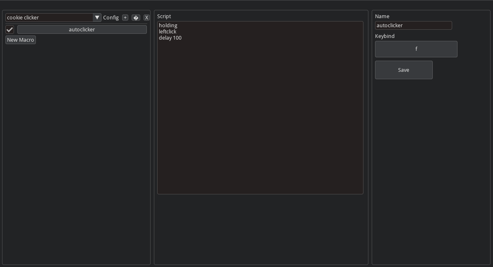

# MacroLite

MacroLite is a small desktop macro tool with its own scripting language.  
It’s a passion project and currently in an early development stage.



---

## What It Does

MacroLite lets you:

- Create macros  
- Assign them to keyboard keys  
- Write scripts using a custom macro language (called **mlite**)  
- Run macros in **holding**, **single**, or **toggle** modes  

It includes a visual editor!

---

## Setup & Running

You have **two ways** to use MacroLite:

---

### 🅰 Path 1 Download Prebuilt Installer

1. Go to the **Releases** section of this repository.
2. Download the latest **MacroLite executable**.
3. Run the `.exe` file  no Python setup required.

---

### 🅱 Path 2  Run Directly

#### 1. Requirements

Python **3.10+**

> [!NOTE]  
> Tested with 3.14, but should work with versions between 3.10–3.14.

---

#### 2. Install Dependencies

```
pip install imgui-bundle pynput
```

---

#### 3. Project Structure

```
MacroLite/
│
├── main.py        UI + hotkey listener  
├── macro.py       Macro engine (script interpreter)  
└── macros.json    Saved configs & macros  
```

---

#### 4. Start the App

```
python main.py
```

---

## Macro Language Guide (mlite)

Each macro script has **two sections**.

---

### MODE (FIRST LINE ONLY)

| Command | Behavior |
|--------|----------|
| `holding` | Macro runs while key is held |
| `single`  | Macro runs once per press |
| `toggle`  | Macro toggles on/off each press |

---

### ACTION COMMANDS

| Command | Description |
|--------|-------------|
| `delay 1000` | Waits X milliseconds |
| `keydown a` | Press key down |
| `keyup a` | Release key |
| `keytap a` | Press and release key |
| `repeat 5` | Start loop (runs next actions 5 times) |
| `repeatend` | Ends the loop |
| `leftclickdown` | Hold left mouse button |
| `leftclickup` | Release left mouse button |
| `leftclick` | Click left mouse button |
| `rightclickdown` | Hold right mouse button |
| `rightclickup` | Release right mouse button |
| `rightclick` | Click right mouse button |
| `middleclickdown` | Hold middle mouse button |
| `middleclickup` | Release middle mouse button |
| `middleclick` | Click middle mouse button |
| `scrollup` | Scroll wheel up |
| `scrolldown` | Scroll wheel down |

---

### Example Macro

```
holding
leftclickdown
delay 10
leftclickup
```

This creates an autoclicker while the key is held.

---

## Known Issues / Limitations

- Cannot bind mouse buttons as hotkeys  
- No emergency stop key yet  
- Keys or mouse could get stuck if the app crashes  
- No macro recording feature  
- No script validation in the UI
- Edit icon not rendering correctly

---

## Project Status

MacroLite is an early-stage passion project focused on learning:

- GUI frameworks  
- Event-driven programming  
- Input simulation  
- Designing a scripting language  

Expect bugs, rough edges, and frequent changes.

---

## Planned Features

- Type text feature
- Mouse movement
- Mouse button keybind support  
- Macro recording  
- Import/export configs

---

Built for fun, learning, and control.
